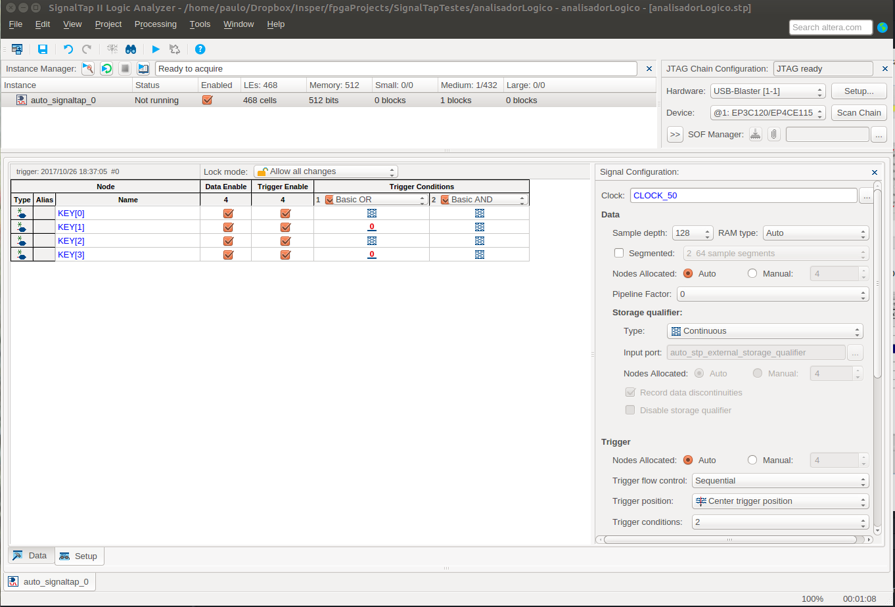

# Atividades

Ir para o [fim do documento](#fimDocumento) e referências.

---

## 1) Análise de circuitos digitais com o analisador lógico.

### Contextualização

Um analisador lógico é um equipamento que permite:

-   Capturar sinais em alta velocidade:

    -   A partir de um sinal (ou combinação de sinais) que criam a condição de início da captura.

-   Exibir esses sinais de forma sincronizada.

Esse recurso permite compreender a dinâmica dos sinais dentro de um circuito digital. Trabalhando com a definição da combinação de disparo da captura e a análise dos resultados, a tarefa de depuração do circuito fica mais fácil.

---

No nosso caso, o fabricante da FPGA que usamos (Intel/Altera), possui um IP (Intellectual Property Core) com as funcionalidades de um analisador lógico. A tela abaixo é do SignalTap II, o IP da Altera.

Esse bloco de código pode ser adicionado ao projeto e monitorar os pontos desejados. Os resultados serão exibidos na tela do computador.

A sua configuração é feita em uma única tela. Ela permite configurar a condição de disparo e as características da captura.

 

---

### Objetivo

Visualizar o comportamento interno de um circuito dentro da FPGA.

### Procedimento

Seguiremos o tutorial da Intel sobre o SignalTap, que está disponível no link abaixo:

Tutorial do [SignalTap II][tutorialSignalTap].

 

#### Referências

[Página com links][linksUteis] de referências sobre VHDL, Quartus, etc ...

---

 [Ir para o início do documento](#inicio).

<!--
######### (inicio dos links) ##########
#######################################
########### Links Internos ############
--->

[tutorialSignalTap]: ./quartus/SignalTap-II-VHDLDesigns(Quartus16-1)2016-11.pdf

[tabelasFD]: ./MIPS/_tabelasFD.html

[linksUteis]: ./linksUteis.html
