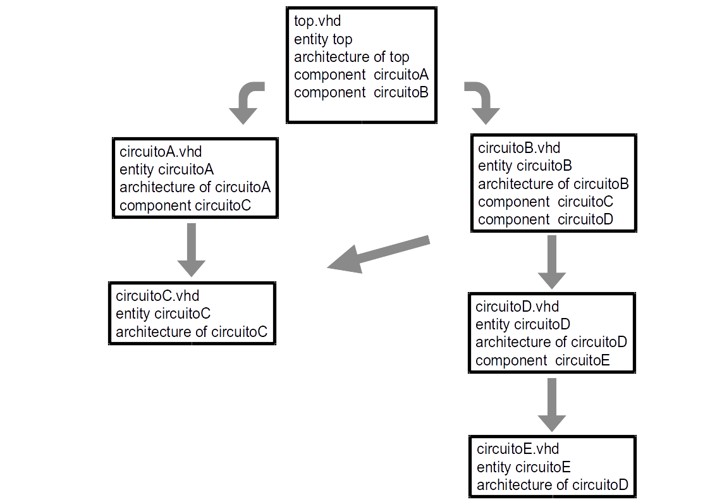
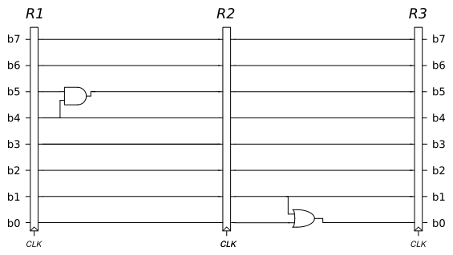

<a name="inicio"></a>

## Objetivos:

1.  Rever lógica sequencial a partir do uso de Templates do Quartus.
2.  Visualização RTL.
3.  Usar projeto hierárquico (Instanciar) em VHDL.

Ir para o [fim do documento](#fimDocumento) e referências.

## Implementações:

### 3) Criação de um projeto hierárquico:

#### Contextualização:

Esse tipo de projeto depende da modularização dos blocos funcionais (em HDL), onde:

-   Cada bloco funcional possui um arquivo com a sua descrição.
-   A utilização dessas funções, dentro do projeto, é feita através da instanciação dentro de um arquivo hierarquicamente superior.
-   Um bloco funcional pode instanciar outros blocos na sua construção.
-   Um mesmo bloco funcional pode ser instanciado várias vezes:
    -   Se houver parametrização (*`generic`*), o seu valor pode ser diferente em cada instância.

Isso cria uma pirâmide de arquivos que definem os níveis de abstração do projeto. O arquivo de mais alta hierárquia é chamado de  *`top-level`*.



É possível utilizar blocos funcionais em outras linguagens HDL:

-   Nesse caso, precisará ser feita a declaração e instanciação através de um *`Component`*:
    -   Verifique a sintaxe, e a diferença entre declarar e instanciar um *`Component`*, nos *templates* dos Quartus.

Por outro lado, se esses blocos forem descritos em VHDL:

-   Poderá ser feita a instaciação direta da entidade (veja nos *templates* dos Quartus).

Dessa forma, cada função terá o seu arquivo particular:

-   Se colocado no mesmo diretório que o *`top-level`*:
    -   A ligação entre os arquivos será automática.
-   Caso não estejam no mesmo diretório:
    -   Deve ser especificado o diretório com as funções na biblioteca do usuário:
        -   No menu: Assignments > Settings > Libraries.

Durante a instanciação definimos:

*   O nome local dado ao circuito sendo instanciado;
*   Os valores dos parâmetros:
    *   Caso existam;
    *   Caso necessite usar valores diferentes do padrão definido.
*   A conexão entre os sinais do circuito instanciado com os sinais do circuito sendo descrito:
    *   Essa associação pode ser posicional:
        *   Como os argumentos em C.
    *   Associada por nomes:
        *   Declara o nome original da porta, no componente instanciado, e a conexão ( => ) como um sinal local, porta local, expressão ou constante;
    *   Ou a porta pode ser deixada desconectada, usando a declaração *`open`*.

Como exemplo, veja a página de suporte da [Intel][IntelHierarchicalDesign].

***

#### Objetivo:
Criar um *`pipeline`* de 8 bits e dois estágios. Dentro dos estágios teremos uma lógica combinacional simples.



**Criação do projeto:**

*   Crie um novo projeto e adicione o arquivo que conterá a entidade *`top-level`*:
    *   Nomeie como quiser, desde que seja o mesmo nome da entidade que ele conterá.
*   Crie, nesse arquivo, o esqueleto do projeto.
*   Defina essa entidade como a *`top-level`* do projeto.
*   Copie o arquivo *registrador.vhd*, do item anterior, para o diretório desse novo projeto e o adicione ao projeto.

Como todos os componentes usados estão em VHDL, utilize a instanciação direta da entidade. Usar a associação por nomes, como mostrado abaixo, facilita a legibilidade do código.

```vhd
R1 : entity work.registrador
generic map (parâmetro => valor)
port map (
  <nome da porta no circuito original> => <sinal no circuito local ou expessão>,
  ...
  <nome da porta no circuito original> => <sinal no circuito local ou expessão>
);
```

O resultado deverá ser similar a [este código][codigoPipeline].

**Compilação e Verificação:**

Compile o circuito e use o *`RTL Viewer`* para confirmar a conexão feita entre os registradores.

**Simulação:**

A simulação é parecida com a utilizada para o registrador:

-   Adicione os sinais que deseja observar. Neste caso, todos.
-   Crie o sinal de *clock*.
-   Faça um vetor de entrada, de 8 bits, com incremento automático.
-   Mude a exibição dos dados para hexadecimal, no vetor de entrada e no de saída.
-   Crie o sinal de *reset* com atuação no inicio da simulação e em outros pontos (e confirme o seu funcionamento).
-   Crie o sinal de habilitação:
    -   Ativado no início;
    -   Durante a simulação mude seu valor por um período superior ao da variação do contador de entrada;
    -   Confira o seu funcionamentos.

Execute a simulação e verifique a relação entre os sinais de entrada, saída e controle.

***

<br>

**Referências:**

[Página com links][linksUteis] de referências sobre VHDL, Quartus, etc ...

***

<a name="fimDocumento"></a> [Ir para o início do documento](#inicio).

<!--
######### (inicio dos links) ##########
#######################################
########### Links Internos ############
--->

[codigoPipeline]: ./vhdl/_pipeline.html

[linksUteis]: ./linksUteis.html

[IntelHierarchicalDesign]: https://www.altera.com/support/support-resources/design-examples/design-software/vhdl/v_hier.html
