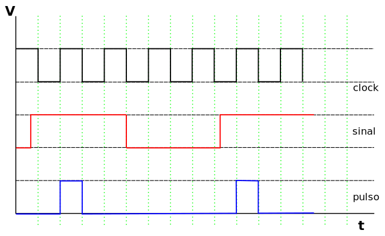

## Objetivos:

1.  Criar máquinas de estados finitos pelo método de estado atual e próximo estado.

Ir para o [fim do documento](#fimDocumento) e referências.

***

## Implementações:

## 1) Detector de borda de subida (FSM Moore).

### Contextualização:

Também conhecido como conversor de nível para pulso, este circuito é útil para interfacear entradas de botões ou chaves.

No nosso caso, ele vai detectar a borda ascendente do sinal de entrada e sincronizar com o sinal de _clock_.

Independentemente do intervalo de tempo que o botão é pressionado, é gerado apenas um pulso na saída do circuito para cada ativação do botão.

Veja o diagrama de tempo abaixo:

 

O diagrama de estado para essa FSM está mostrado abaixo:

 

***

### Objetivo:

A primeira implementação será uma FSM utilizando o diagrama acima.

Para tanto, será necessário:

-   Criar a tabela de transição;
-   Criar a tabela de saída;
-   Fazer a codificação dos estados;
-   Criar a tabela de estado atual e próximo estado com a codificação;
-   Obter as equações lógicas;
-   Implementar o circuito no Quartus, utilizando a ferramenta de desenho de esquema;
-   Simular e conferir o funcionamento.

***

**Referências:**

[Página com links][linksUteis] de referências sobre VHDL, Quartus, etc ...

***

 [Ir para o início do documento](#inicio).

<!---
######### (inicio dos links) ##########
--->

[linksUteis]: ./linksUteis.html
