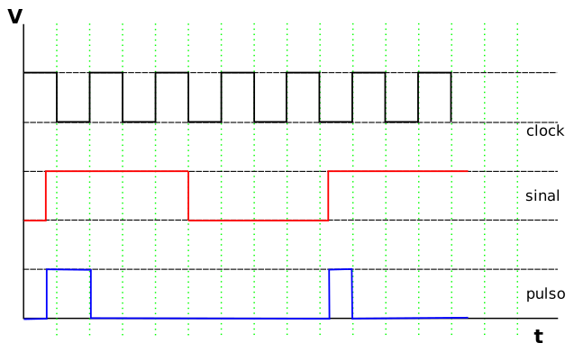

## Objetivos:

1.  Criar máquinas de estados finitos pelo método de estado atual e próximo estado.

Ir para o [fim do documento](#fimDocumento) e referências.

***

## Implementações:

## 2) Detector de borda de subida (FSM Mealy).

O diagrama de estado para essa FSM está mostrado abaixo:

 

***

### Objetivo:

Implementar o circuito da FSM utilizando o diagrama acima.

Para tanto, será necessário:

-   Criar a tabela de transição e saída;
-   Fazer a codificação dos estados;
-   Criar a tabela de estado atual e próximo estado com a codificação;
-   Obter as equações lógicas;
-   Implementar o circuito no Quartus, utilizando a ferramenta de desenho de esquema;
-   Simular e conferir o funcionamento.

O resultado deve ser parecido com o diagrama de tempo mostrado abaixo:

***

**Referências:**

[Página com links][linksUteis] de referências sobre VHDL, Quartus, etc ...

***

 [Ir para o início do documento](#inicio).

<!---
######### (inicio dos links) ##########
--->

[linksUteis]: ./linksUteis.html
