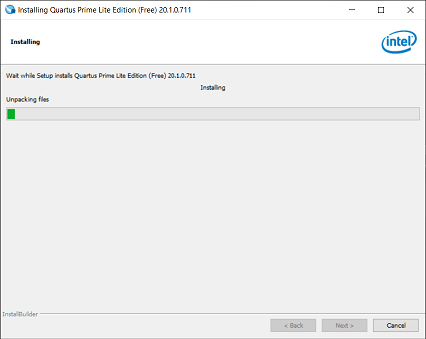
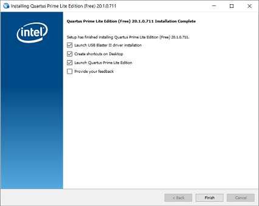
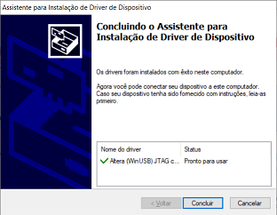
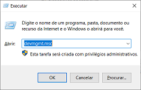
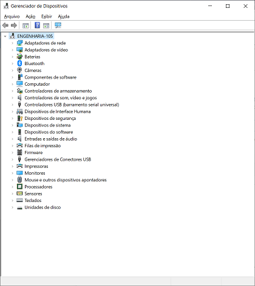
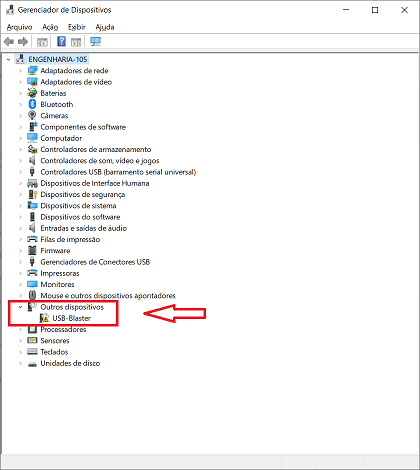
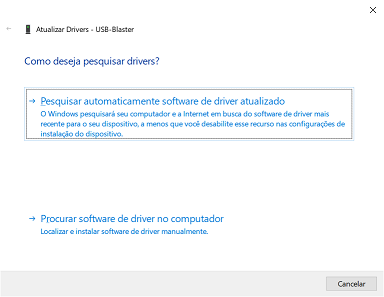
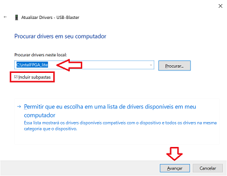
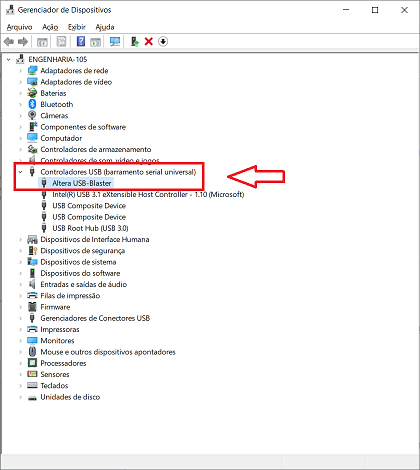
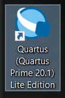

Windows 10
==========

Por: Marco Antonio Soares de Mello Alves (Laboratório de Arquitetura de
Computadores)

Dúvidas:

> **Email: marcoasma@insper.edu.br**

> **Teams: marco.alves@al.insper.edu.br**

Quartus 20.1 e ModelSim 20.1
============================

Instalando
----------

1.  Faça o download dos arquivos a seguir (salve na mesma pasta, todos
    os arquivos):

-   Quartus Lite 20.01:
    https://download.altera.com/akdlm/software/acdsinst/20.1std/711/ib_installers/QuartusLiteSetup-20.1.0.711-windows.exe

-   ModelSim:
    https://download.altera.com/akdlm/software/acdsinst/20.1std/711/ib_installers/ModelSimSetup-20.1.0.711-windows.exe

-   Cyclone V (Chip usado no curso) :
    https://download.altera.com/akdlm/software/acdsinst/20.1std/711/ib_installers/cyclonev-20.1.0.711.qdz

2.  Execute o arquivo **QuartusLiteSetup-20.1.0.711-windows.exe** e
    clique **Next** até a instalação iniciar:
    

  

    

3.  Após a instalação, finalize-a com as seguintes opções:

4.  A instalação do USB Blaster deverá iniciar em seguida:

Atualizando o USB Blaster
-------------------------

Mesmo instalando o driver é necessário atualiza-lo.

1.  Pressione Windows + R no teclado e insira o comando **devmgmt.msc**:

2.  O gerenciador de dispositivo deverá abrir:

3.  Conecte a placa e o driver USB-Blaster será reconhecido da seguinte
    maneira:

4.  O símbolo de atenção em amarelo indica que o driver está
    desatualizado, selecione a opção **Atualizar driver** clicando com o
    botão direito do mouse em cima do USB-Blaster, a janela a baixo
    deverá abrir:

5.  Selecione a opção **Procurar software de driver no computador** e
    defina o caminho da pasta intelFPGA\_lite (caso tenha sido alterado
    o caminho de instalação do quartus o padrão é "\*\*C:\_lite\*\*"),
    selecione incluir subpastas e clique em avançar:

6.  Aguarde a instalação do drive e o USB-Blaster agora deverá aparecer
    como **Altera USB-Blaster**, conforme a imagem abaixo:

Validando
=========

1.  Execute o Quartus (**Quartus (Quartus Prime 20.1) Lite Edition**),
    esse ícone deverá estar na sua área de trabalho:

2.  Selecione a segunda opção **Run the Quartus Prime Software**

3.  Por fim, o programa deverá abrir:

quartusAberto
