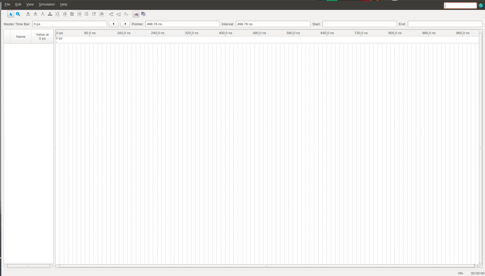

## Para simular o circuito, crie uma nova simulação:

-   Menu File:
    -   New:
        -   Verification/Debug Files:
            -   University Program VWF;
            -   OK.

-   Abrirá uma nova tela com o simulador:
    -   Simulation Waveform Editor.

## A tela 'Simulation Waveform Editor':

## Selecione os sinais do circuito que deseja ver na simulação:
-   Menu Edit:
    -   Insert:
        -   'Insert Node or Bus'.
-   Na tela de 'Insert Node or Bus':
    -   Clique em 'Node Finder'.
-   Na tela de 'Node Finder':
    -   Clique em List:
        -   Escolha os sinais para simular;
        -   OK.
    -   OK.

## Crie os estímulos (sinais) de entrada para a simulação:
-   Selecione a primeira entrada no seu ícone 'In':
    -   Selecione o ícone de 'Count Value':
        -   Em 'Transitions occour', digite 10 e escolha a unidade de “ns” (nanosegundos).
        -   OK.
 

-   Faça o mesmo para a segunda entrada e escolha 20 ns.
-   Note que foi criada a sequência binária da tabela da verdade.
-   Salve a sua simulação.

## Ajuste a janela de tempo para simulação:
-   Caso queira diminuir a janela de tempo mostrada:
    -   Edit:
        -   Set End Time...
            -   Digite 40 (ns).

## Execute a simulação funcional:
-   Clique no ícone:
    -   Run Functional Simulation.

-   Caso não haja erros, deverá aparecer uma **nova tela** com a simulação.

-   Verifique se o resultado é coerente com a tabela da verdade dessa porta.

 [Ir para o início do documento](#inicio).
